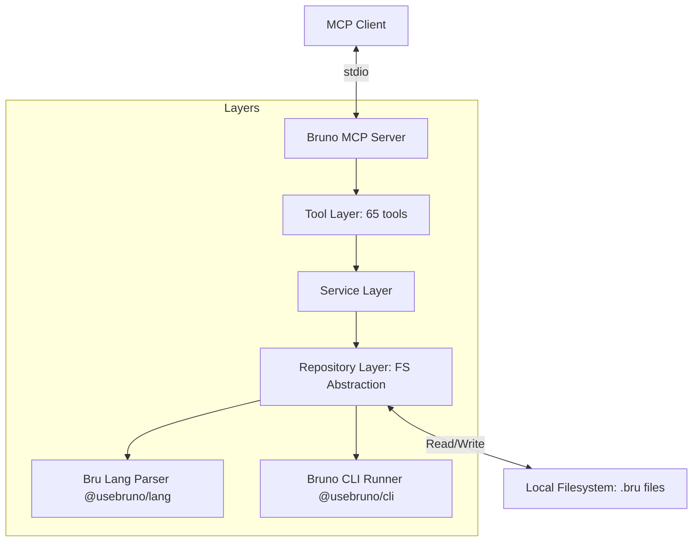
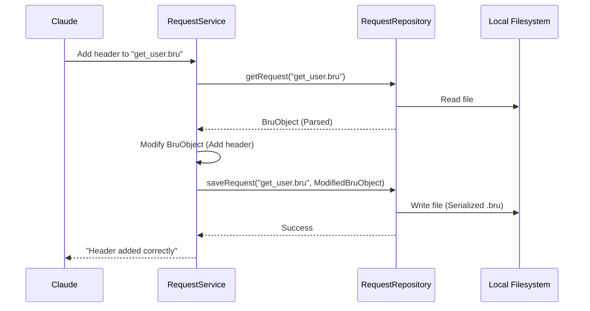

# Bruno MCP Server - Guía del Desarrollador

Detalles internos de la arquitectura y diseño técnico para el servidor MCP de Bruno REST API.

## 🏗️ Arquitectura de Capas

El servidor basa su operación en el parseo dinámico de archivos `.bru` y su manipulación en el sistema de archivos (FS).



### Componentes Principales

1.  **Repository Layer (`src/repositories/`):** Utiliza un `BaseFileRepository<T>` genérico para centralizar operaciones de entrada/salida sobre el FS. Abstrae la persistencia de Épicas, Requests y Ambientes en formato .bru.
2.  **Service Layer (`src/services/`):** Lógica que no depende del FS. Maneja interpolación de variables, validación de scripts JS (Chai) y orquestación de importaciones desde OpenAPI o Postman.
3.  **Bru Lang Integración:** El servidor utiliza los parsers y serializadores oficiales de Bruno (`@usebruno/lang`) para asegurar compatibilidad total con el cliente desktop.
4.  **CLI Runner Integration:** Las herramientas de ejecución delegan el runtime a `@usebruno/cli` para garantizar que los scripts de pre-request y post-response se ejecuten idénticamente a como lo harían en el cliente oficial.

---

## 🛠️ Stack Tecnológico

-   **Runtime:** Node.js 20+
-   **Architecture:** Model Context Protocol (MCP) v1.x+.
-   **Parser:** `@usebruno/lang` para archivos `.bru`.
-   **Runner:** `@usebruno/cli` para ejecución de requests.
-   **Validation:** `Zod` para validar esquemas de configuración y DTOs de herramientas.
-   **Log:** `Pino` para logs estructurados legibles por máquina.

---

## 🔁 Flujo de Edición de Archivos

Al modificar un request, el servidor realiza un flujo de lectura, actualización en memoria y escritura atómica:



---

## 🛠️ Cómo Extender

### Agregar una nueva herramienta
1.  **Define Schema:** En `src/tools/`, crea un nuevo archivo de herramientas para el dominio (ej: `auth.tools.ts`).
2.  **Define DTO:** Crea las interfaces necesarias en `src/dto/`.
3.  **Implementa Service:** Añade el método de negocio en el servicio adecuado.
4.  **Añade Repo Methods:** Si necesitas operaciones de FS específicas, añádelas al repositorio correspondiente.

### Testing con Vitest
El servidor incluye tests de integración que utilizan un sistema de archivos virtual o temporal para verificar la manipulación de archivos `.bru` sin comprometer datos reales.
```bash
npm test
```
