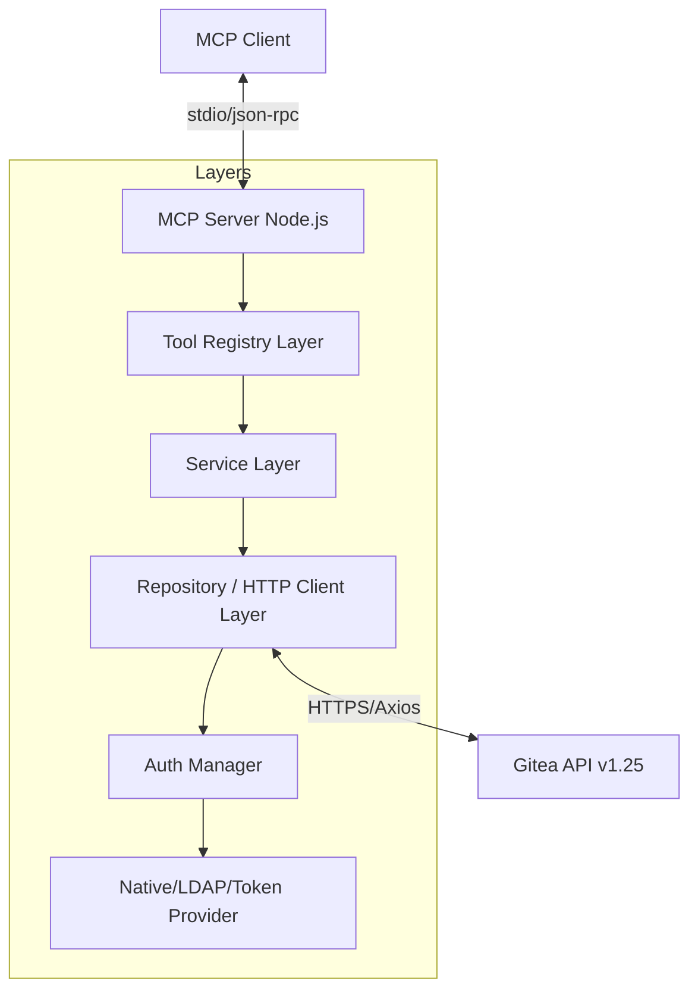
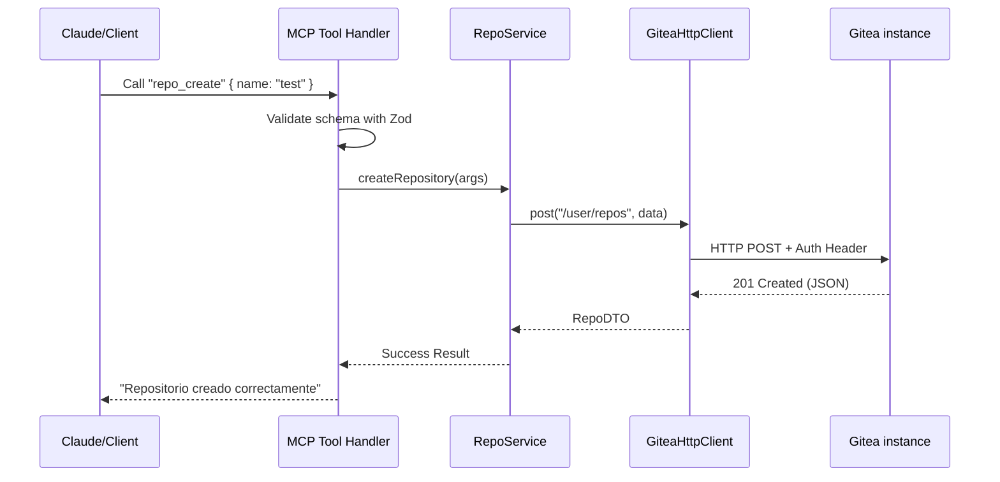

# Gitea MCP Server - Guía del Desarrollador

Documentación técnica sobre la arquitectura interna y desarrollo del servidor MCP para Gitea.

## 🏗️ Arquitectura de Capas

El servidor implementa una arquitectura desacoplada diseñada para manejar los ~269 endpoints de la API de Gitea de forma mantenible.



### Componentes Principales

1.  **Tool Registry Layer (`src/tools/`):** Define los esquemas Zod para los inputs de cada herramienta (269 en total). Mapea cada herramienta a un método específico del Service Layer.
2.  **Service Layer (`src/services/`):** Orquestación de lógica. Un service por dominio (RepoService, UserService, OrgService). Se encarga de las transformaciones de datos y de la lógica de negocio.
3.  **Repository Layer (`src/repositories/`):** Abstracción de las llamadas HTTP. Utiliza el cliente centralizado para realizar peticiones filtradas, paginación automática y reintentos.
4.  **Auth Layer (`src/auth/`):** Implementa el patrón Strategy. Soporta tres tipos de autenticación (`Native`, `LDAP`, `Token`) que proveen los headers necesarios para cada petición.

---

## 🛠️ Stack Tecnológico

-   **Runtime:** Node.js 20+
-   **TypeScript:** 5.x+, compilado a ESM (ECMAScript Modules).
-   **SDK:** `@modelcontextprotocol/sdk` para la implementación del protocolo.
-   **Client:** `Axios` con interceptores para reintentos y mapeo de errores (`GiteaAPIError`).
-   **Validation:** `Zod` para asegurar que los inputs de las herramientas sean correctos.

---

## 🔁 Flujo de una Petición

El siguiente diagrama muestra el flujo desde que el usuario envía un prompt hasta que recibe la respuesta de Gitea.



---

## 🛠️ Cómo Extender el Proyecto

### Agregar una nueva herramienta
1.  **Definir el Schema en `src/tools/schema.ts`:**
    ```typescript
    export const repo_new_tool_schema = z.object({
      repo_name: z.string().describe("Nombre del repositorio"),
    });
    ```
2.  **Agregar el handler en `src/index.ts`:**
    Mapea la nueva herramienta al service correspondiente.
3.  **Implementar en Service:**
    Define la lógica en `RepoService.ts`.
4.  **Añadir en Repository:**
    Crea el endpoint si no existe en el cliente HTTP.

### Testing
Ejecuta los tests usando Vitest:
```bash
npm test
```
Los tests están divididos por dominio e incluyen mocks de la API de Gitea para asegurar la estabilidad sin integraciones externas.
