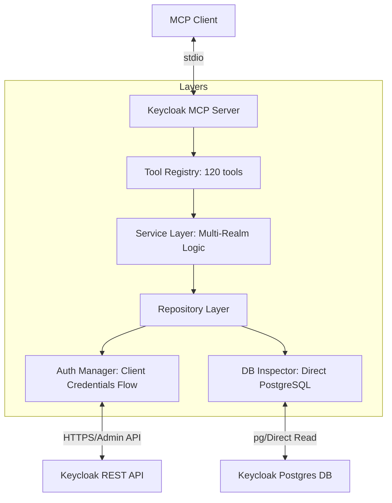
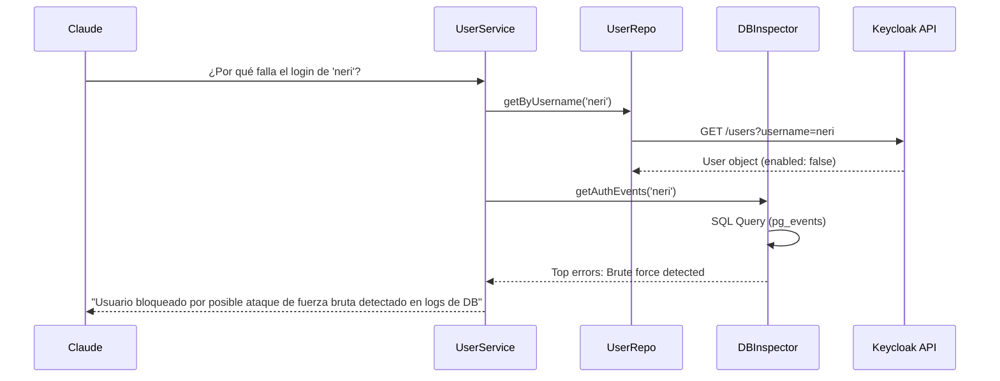

# Keycloak MCP Server - Guía del Desarrollador

Detalles internos de la arquitectura del servidor MCP para la Admin REST API v26.x de Keycloak y su inspector de base de datos PostgreSQL.

## 🏗️ Arquitectura de Capas Híbrida

El servidor se diseña con un enfoque híbrido: API REST para operaciones seguras (escritura/lectura) e Inspección Directa de DB (solo lectura) para análisis masivo.



### Componentes de Ingeniería

1.  **Auth Manager (`src/auth/`):** Implementa el flujo de `client_credentials` de OAuth2. Soporta rotación automática de tokens y reintento con backoff exponencial para errores 429 (Rate Limit).
2.  **DB Inspector (`src/db/`):** Módulo de solo lectura basado en un set de queries SQL pre-optimizadas sobre el catálogo de Keycloak (`pg_catalog` y tablas específicas de realms).
3.  **Service Layer (`src/services/`):** Orquestación compleja. Unifica datos de la API y de la DB cuando es necesario. Aplica patrones de validación Zod en cada paso.
4.  **Repository Layer (`src/repositories/`):** Abstracción por dominio (RealmRepository, UserRepository, ClientRepository). Mantiene las interfaces segregadas para cumplir con el ISP (Interface Segregation Principle).

---

## 🛠️ Stack Tecnológico

-   **Runtime:** Node.js 20+
-   **Architecture:** Model Context Protocol (MCP) v1.x+.
-   **HTTP Client:** `Axios` con interceptores para Auth re-entry y re-auth.
-   **DB Client:** `pg` (node-postgres) para la inspección directa.
-   **Logging:** `Pino` para trazabilidad de errores (con hints para el LLM).
-   **Detección de Ataques:** Mapeo de errores 403/409/429 a respuestas estructuradas para el LLM.

---

## 🔁 Flujo de Diagnóstico de Usuario

El servidor puede combinar fuentes para dar un diagnóstico completo (API + DB):



---

## 🛠️ Cómo Desarrollar y Extender

### Agregar una nueva herramienta de API
1.  **Schema:** Define el input en `src/tools/keycloak.tools.ts`.
2.  **DTO:** Crea la interfaz en `src/dto/`.
3.  **Service:** Añade el método en el servicio correspondiente (ej: `RealmService`).
4.  **Handler:** Registra la herramienta en el punto de entrada.

### Agregar una nueva herramienta de DB
1.  **Define Query SQL:** Añade la consulta a `src/db/queries.ts`.
2.  **Define Herramienta:** Sigue el mismo proceso anterior, pero delega el handler al modulo `DBInspector`.

### Testing
Ejecuta la suite de pruebas unitarias:
```bash
npm test
```
Los tests verifican la integridad de la base de datos de Keycloak mediante mocks de PostgreSQL y el flow de autenticación de admin con la REST API.
