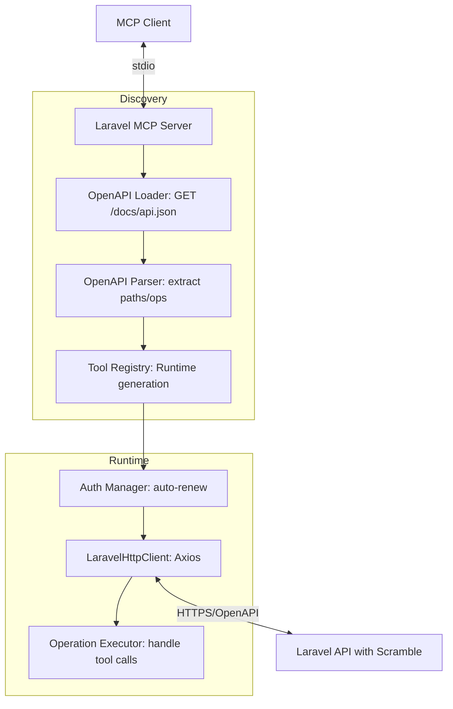
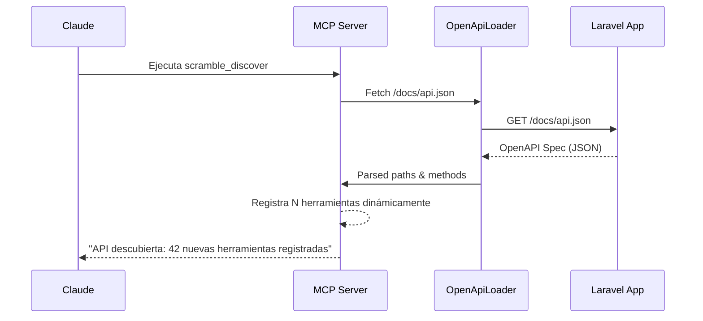

# Laravel Scramble MCP Server - Guía del Desarrollador

Documentación técnica sobre el diseño dinámico y runtime del servidor MCP para APIs documentadas con Scramble.

## 🏗️ Arquitectura de Generación Dinámica

A diferencia de los servidores estáticos, este utiliza un patrón de descubrimiento en tiempo real basado en el esquema OpenAPI de Scramble.



### Componentes de Ingeniería

1.  **OpenAPI Parser (`src/openapi/`):** Analiza el JSON de Scramble para extraer `operationId`, `parameters` y `requestBody`. Genera dinámicamente un esquema Zod para cada operación en tiempo de ejecución.
2.  **Tool Registry (`src/openapi/`):** Mapea cada `operationId` a un nombre de herramienta MCP normalizado (ej: `users.store` -> `scramble_users_store`).
3.  **Operation Executor (`src/http/`):** Handler genérico que recibe los inputs del MCP, los inyecta en la URL (path params), query params o el body, y realiza la petición HTTP adecuada.
4.  **Auth Layer (`src/auth/`):** Gestiona el ciclo de vida del token (Bearer, API Key o Session). Incluye un interceptor de Axios para realizar el refresh automático ante errores 401.

---

## 🛠️ Stack Tecnológico

-   **Runtime:** Node.js 20+
-   **OpenAPI Discovery:** Dinámico desde la API (v3.1.0 compatible).
-   **Schema Conversion:** `zod-to-json-schema` + `json-schema-to-zod` para los inputs.
-   **Client:** `Axios` con interceptores para Auth y Retry.
-   **Logging:** `Pino` para logs estructurados y debug de red.

---

## 🔁 Flujo de Descubrimiento de API

El servidor se reconfigura solo sin necesidad de reiniciar el proceso Node.js:



---

## 🛠️ Cómo Desarrollar y Extender

### Modificar el generador de herramientas
1.  **Operation Parser:** Si necesitas soportar nuevos tipos de datos de Scramble, edita `src/utils/schema-converter.ts`.
2.  **Auth Strategies:** Para añadir un nuevo tipo de autenticación, implementa el provider correspondiente en `src/auth/providers/`.
3.  **Tool Metadata:** Para cambiar cómo se muestran las descripciones en el LLM, edita `src/utils/markdown.ts`.

### Testing
Ejecuta la suite de pruebas unitarias y de integración:
```bash
npm test
```
Los tests verifican la generación dinámica de esquemas Zod a partir de un mock de OpenAPI y la correcta orquestación de llamadas HTTP.
