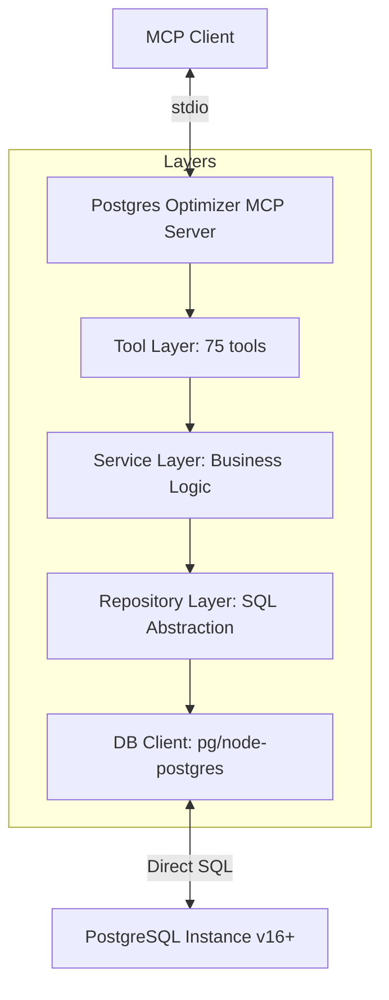
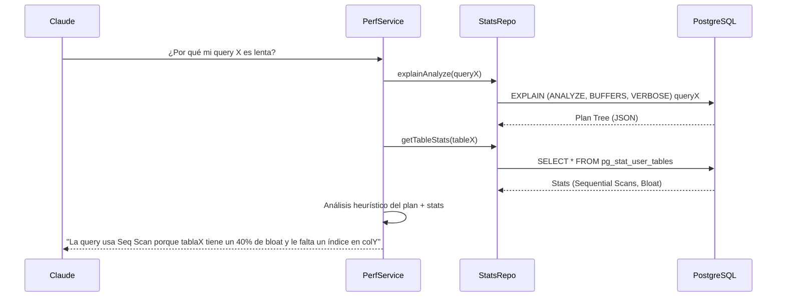

# Postgres Optimizer MCP Server - Guía del Desarrollador

Información técnica para desarrolladores sobre el servidor MCP para el análisis y optimización avanzada de PostgreSQL v16/v17/v18.

## 🏗️ Arquitectura de Optimización

El servidor se apoya directamente en la introspección del catálogo de sistemas y vistas de rendimiento nativas de PostgreSQL.



### Componentes Técnicos

1.  **Catalog Introspection (`src/db/`):** Contiene un repositorio de queries SQL curadas para extraer metadatos de `pg_catalog`, `information_schema` y extensiones como `pg_stat_statements`.
2.  **Service Layer (`src/services/`):** Implementa algoritmos de detección de problemas (ej: heurísticas para bloat, recomendaciones de índices). No solo ejecuta SQL, sino que interpreta los resultados para dar "hints" al LLM.
3.  **Config Manager (`src/config/`):** Gestiona la conexión y valida los permisos de seguridad (Whitelist de comandos DDL/DML permitidos).
4.  **Zod Schema Registry (`src/tools/`):** Mapea cada herramienta a un esquema de entrada tipado, asegurando que los parámetros como nombres de tablas o schemas sean válidos antes de enviarlos a la DB.

---

## 🛠️ Stack Tecnológico

-   **Runtime:** Node.js 20+
-   **Architecture:** Model Context Protocol (MCP) v1.x+.
-   **Client Database:** `pg` (node-postgres) con soporte para pool de conexiones.
-   **PostgreSQL Compatible:** Soporta características específicas de v16 (Logical Replication stats), v17 (Active queries history) y v18 (Advanced monitoring).
-   **Validation:** `Zod` para validar inputs complejos.
-   **Log:** `Pino` para logs estructurados y debug de consultas.

---

## 🔁 Flujo de Análisis de Rendimiento

El servidor combina múltiples fuentes para dar un diagnóstico completo (Metadata + Stats):



---

## 🛠️ Cómo Desarrollar y Extender

### Agregar una nueva herramienta de análisis
1.  **SQL Query:** Define la consulta SQL en el repositorio adecuado (ej: `src/repositories/stats.repository.ts`).
2.  **Tool Definition:** Registra la herramienta en `src/tools/perf.tools.ts` con su esquema Zod.
3.  **Service Integration:** Implementa la lógica en el servicio de performance para interpretar los resultados crudos de la DB.

### Cómo Testear
Ejecuta la suite de pruebas unitarias:
```bash
npm test
```
Los tests verifican la correcta generación de SQL y el parseo de los planes de ejecución (`JSON EXPLAIN`) devueltos por PostgreSQL.
