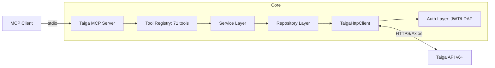
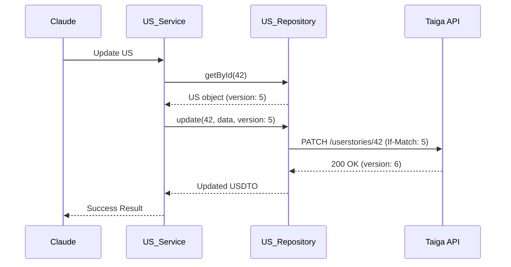

# Taiga MCP Server - Guía del Desarrollador

Información técnica para desarrolladores sobre el servidor MCP para la API REST de Taiga.

## 🏗️ Arquitectura de Componentes

El servidor de Taiga está estructurado para manejar 71 herramientas mediante una capa de servicios desacoplada y un cliente HTTP centralizado con soporte JWT.



### Componentes Técnicos

1.  **Manejo de Versiones (OCC):** Taiga usa Optimistic Concurrency Control (OCC). El Service Layer encapsula el manejo de `version` enviando el header `If-Match` necesario para las actualizaciones atómicas.
2.  **Auth Manager (`src/auth/`):** Gestiona el ciclo de vida del token JWT. Implementa el login inicial y un interceptor de Axios para refrescar el token automáticamente ante errores 401.
3.  **Repository Pattern (`src/repositories/`):** Abstrae las llamadas CRUD genéricas en `BaseRepository<T>`, reduciendo la duplicación de código para Épicas, User Stories y Tareas.
4.  **Service Layer (`src/services/`):** Aplica validaciones de negocio adicionales y orquesta llamadas a múltiples repositorios cuando es necesario (ej: vincular una US a una Épica).

---

## 🛠️ Stack Tecnológico

-   **Runtime:** Node.js 20+
-   **Software Architecture:** Model Context Protocol (MCP) v1.x+.
-   **Client:** `Axios` con interceptores para Auth y Rate Limiting.
-   **Log:** `Pino` para logs estructurados JSON legibles por máquinas.
-   **Validation:** `Zod` para validar inputs complejos (objetos anidados).

---

## 🔁 Flujo de Edición con OCC

El servidor gestiona automáticamente la complejidad del control de concurrencia de Taiga:



---

## 🛠️ Cómo Desarrollar

### Agregar una nueva herramienta
1.  **Schema:** Define el input en `src/tools/taiga.tools.ts`.
2.  **Service:** Añade el método en `src/services/taiga.service.ts`.
3.  **Handler:** Registra la herramienta en el punto de entrada de la aplicación.
4.  **Repository:** Crea o actualiza el repositorio si el endpoint de la API no está mapeado.

### Testing con Vitest
El servidor incluye suites de tests unitarios y de integración:
```bash
npm test
```
Los tests verifican el flow de autenticación, la recuperación tras expiración de token y el manejo correcto de errores de validación de Taiga.
